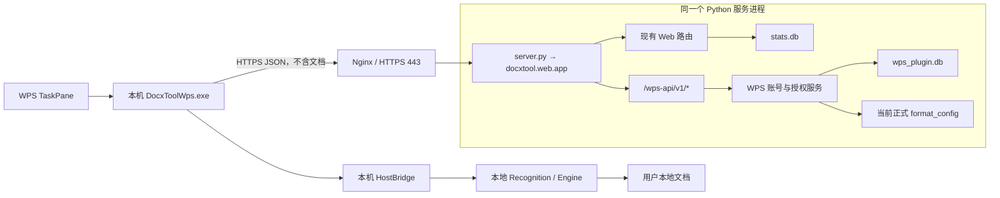

# DocxTool WPS 公网服务第一阶段技术设计

## 1. 文档定位

- 文档职责：说明 `WPS_SERVER_PRD.md` 第一阶段功能如何在当前仓库中实现。
- 上位需求：`WPS_SERVER_PRD.md`。
- 上位工程规则：`AGENTS.md`、`docs/API.md`、`docs/DEPLOY.md`。
- 当前状态：第一阶段九轮实现及自动门禁已完成；真实 WPS 宿主操作仍需发布前人工验收。
- 第一实现目标：先完成可独立联调的 WPS 公网服务器，再接入用户端 EXE 和 WPS TaskPane。
- 唯一启动入口：服务器本地开发和部署继续执行根目录 `server.py`，不新增第二个服务器启动脚本。

本文只定义第一阶段已经确认的注册登录、设备、24 小时会话、心跳、免费一键排版授权、结果回传和管理后台。卡密、付费权益、套餐、次数扣减和远程主动控制不在本阶段实现。

## 2. 当前代码事实

技术实现必须复用当前仓库已经存在的能力：

| 当前文件 | 可复用能力 |
| --- | --- |
| `server.py` | 加载根目录 `.env` 并调用 `docxtool.web.app.main()`，继续作为统一启动入口 |
| `src/docxtool/web/app.py` | `ThreadingHTTPServer` 组合根、运行配置、共享锁和 Handler 依赖装配 |
| `src/docxtool/web/routing.py` | 纯路径匹配，不执行数据库或业务逻辑 |
| `src/docxtool/web/handler_dispatch.py` | 将匹配结果分派到 Handler 薄方法 |
| `src/docxtool/web/handler.py` | HTTP 请求读取、响应发送和现有管理员鉴权入口 |
| `src/docxtool/storage/database.py` | SQLite 相对路径解析、连接、Row 工厂和 WAL 使用方式 |
| `src/docxtool/auth/` | 复用 Argon2id 密码摘要和验证；WPS 账号格式使用独立规则 |
| `src/docxtool/document/style_config.py` | `validate_format_config()`，用于验证服务器下发的排版配置 |
| `src/docxtool/paths.py` | `project_path()`、`default_format_config_path()` 等可移动路径能力 |
| `src/docxtool/web/admin_access.py` | 现有管理员会话与 CSRF 校验 |
| `apps/wps/host-runtime.js` | 本机 `apply` 命令、格式前置检测、事务、Engine 调用和文档重开 |

现有网页用户会话默认 30 天。本项目新增的 WPS 会话必须独立实现为固定 24 小时，不修改网页用户表、网页 Cookie 或网页会话时长。

## 3. 目标架构



关键边界：

1. 公网服务器只返回账号状态、功能状态和格式配置，不接收 DOC、DOCX、WPS、正文、文件名、路径、识别结果、批注、图片或表格。
2. `server.py` 启动一个 Python 服务和一个 HTTP 端口；WPS API 与现有 Web API 共用进程，但使用独立 SQLite 文件和独立线程锁。
3. 一键排版仍由本地 `apply` 命令执行。公网服务器只在执行前授权，不远程操作 WPS 对象。
4. 本地功能不经过公网授权；只有 `apply` 和未来明确列入受控清单的功能调用授权接口。
5. 第一阶段不建立 WebSocket、消息队列、第二个公网端口或独立微服务。
6. 管理后台重建为统一工作台，但网页业务和 WPS 插件业务只能分别访问自己的数据库。

## 4. 建议目录与文件

### 4.1 新增服务端文件

```text
src/docxtool/wps_server/
├─ __init__.py          # 公开第一阶段必要入口，不承载业务逻辑
├─ config.py            # 数据库路径、24 小时会话、心跳和功能清单常量
├─ validation.py        # WPS 账号、密码、设备和请求字段的权威校验
├─ database.py          # WPS SQLite 连接、四张表、索引和 schema 初始化
├─ auth.py              # Bearer 解析、会话签发、查询、失效和退出
├─ format_config.py     # 读取并验证当前正式排版配置，返回配置版本
├─ service.py           # 注册、登录、心跳、授权、结果回传业务事务
├─ route_handlers.py    # WPS JSON 请求读取、响应和七个用户接口处理
└─ admin.py             # 管理员查询、状态修改和两张服务端 HTML 页面
```

不新增通用 Repository、ORM、依赖注入容器、事件总线或插件注册器。四张表和七个接口规模较小，业务 SQL 直接留在 `service.py` 和 `admin.py`，避免为单一实现增加转发层。

### 4.2 修改现有服务端文件

| 文件 | 最小修改 |
| --- | --- |
| `src/docxtool/web/app.py` | 创建 WPS 数据库连接工厂、独立锁和当前格式配置；启动时同时初始化两个数据库 |
| `src/docxtool/web/routing.py` | 增加 WPS 用户接口和管理员页面的纯路由匹配 |
| `src/docxtool/web/handler_dispatch.py` | 将新增动作分派到 Handler 方法 |
| `src/docxtool/web/handler.py` | 增加 WPS 用户接口和管理员页面的薄处理方法 |
| `src/docxtool/web/admin_workspace_page.py` | 新增统一管理员外壳、一级导航和综合概览页面 |
| `src/docxtool/web/admin_session_routes.py` | 管理员登录成功后改为进入新的 `/admin` 工作台 |
| `src/docxtool/web/monitor_dashboard_page.py` | 将现有监控内容收口为“网页业务”模块，并复用统一管理员外壳 |
| `src/docxtool/web/health.py` | readiness 中增加 WPS 数据库可连接状态 |
| `.env.example` | 增加 `WPS_DATABASE_PATH=var/data/wps_plugin.db` |
| `docs/API.md` | 功能实现后补充正式 HTTP 契约 |
| `docs/DEPLOY.md` | 功能实现后补充 WPS 数据库备份和公网路径 |
| `docs/PROJECT_FILE_TREE.md` | 功能实现后登记新增模块职责 |

`server.py` 原则上不需要修改。它继续加载 `.env` 并调用 `docxtool.web.app.main()`；WPS 服务由 `app.main()` 的数据库初始化和路由装配自动加入。

### 4.3 后续用户端文件

服务端完成后，用户端接入阶段再新增或修改：

```text
apps/wps/public_api.py               # 调用公网注册、登录、心跳、授权和结果接口
apps/wps/account_store.py            # 本地账号 SQLite 和 Windows DPAPI 密文读写
apps/wps/login_window.py             # 启动器独立登录注册窗口
apps/wps/main.py                     # 启动前检查账号并决定显示窗口或直接启动插件
apps/wps/control/server.py           # 向 Host 提供受控排版入口
apps/wps/host-runtime.js             # apply 前接收授权请求编号和配置版本，执行本机文档操作
apps/wps/taskpane.html               # 只显示账号状态，不提供登录注册入口
apps/wps/taskpane.js                 # 从 Bridge 状态长请求更新账号与授权状态，不保存或提交密码
```

第一阶段服务端实现期间不修改这些 WPS 文件，先使用模拟客户端验证公网闭环。

## 5. 服务启动方式

### 5.1 唯一入口

本地和服务器统一执行：

```text
python server.py
```

启动链保持：

```text
server.py
→ 加载 .env
→ docxtool.web.app.main()
→ 校验现有服务密钥
→ 初始化 stats.db
→ 初始化 wps_plugin.db
→ 读取并验证当前正式 format_config
→ 启动 127.0.0.1:9527
```

`apps/wps/main.py` 仍是用户电脑上的 WPS 插件启动器，不是公网服务器入口，也不与根目录 `server.py` 合并。

### 5.2 `app.py` 组合方式

建议在 `app.py` 中增加以下组合根对象和函数：

```python
_WPS_SQL_LOCK = _runtime_state_create_sql_lock()
_WPS_DB_PATH = resolve_wps_database_path()
_WPS_FORMAT_PROFILE = load_active_format_profile()

def _wps_sql(): ...
def _initialize_all_databases() -> None: ...
```

`_initialize_all_databases()` 依次调用现有 `_sql_init()` 和新增 `initialize_wps_database()`。`main()` 继续调用现有 `run_http_service()`，只把 `init_database` 参数改为 `_initialize_all_databases`。两个数据库不共享连接、不共享锁、不使用跨库事务。

### 5.3 配置常量

`src/docxtool/wps_server/config.py` 只定义当前阶段真正使用的配置：

```python
WPS_SESSION_TTL_SECONDS = 24 * 60 * 60
WPS_HEARTBEAT_INTERVAL_SECONDS = 10 * 60
WPS_OFFLINE_AFTER_SECONDS = 30 * 60
WPS_JSON_MAX_BYTES = 32 * 1024
WPS_CONTROLLED_COMMANDS = frozenset({"apply"})

def resolve_wps_database_path(value=None): ...
def public_feature_manifest() -> dict: ...
```

环境变量只新增：

```text
WPS_DATABASE_PATH=var/data/wps_plugin.db
```

24 小时会话、10 分钟心跳建议值和 30 分钟离线判断属于本阶段固定产品规则，不做成可变环境开关。

### 5.4 用户端启动入口

用户电脑仍独立执行：

```text
DocxToolWps.exe
```

开发阶段等价入口为：

```text
python apps/wps/main.py
```

`main.py` 在创建 Control Server、插件网页服务和 WPS 发布配置之前先调用：

```python
def resolve_startup_account() -> dict: ...
```

行为固定为：

```text
读取本地账号
├─ 没有账号：显示独立登录注册窗口，成功后继续启动
└─ 已有账号：不显示窗口，直接启动插件
   ├─ 会话有效：后台 heartbeat
   ├─ 会话过期：后台使用 DPAPI 解密密码并静默登录
   ├─ 账号被拒绝：清除本地凭据并显示登录注册窗口
   └─ 网络不可用：保持本地功能启动，apply 暂不可用
```

登录注册窗口属于启动器进程，不嵌入 `taskpane.html`，也不依赖 WPS 已经打开。

## 6. 数据库设计

### 6.1 连接与版本

`database.py` 提供：

```python
def connect(path=None) -> sqlite3.Connection: ...
def initialize_database(connect_func, sql_lock) -> None: ...
```

连接规则：

- 相对路径相对于项目根目录解析。
- 自动创建数据库父目录。
- 使用 `sqlite3.Row`。
- 开启 `PRAGMA journal_mode=WAL`。
- 开启 `PRAGMA foreign_keys=ON`。
- 使用 `PRAGMA user_version=1` 记录 schema 版本，不增加第五张元数据表。
- 发现数据库版本高于当前程序支持版本时立即停止启动，不猜测兼容。

所有时间使用 UTC Unix 秒整数。管理员页面负责转换为中文本地时间，不在数据库中混用文本时间。

### 6.2 四张核心表

以下 SQL 是第一版目标结构。代码字段保持英文，管理页面和文档展示使用中文名称。

```sql
CREATE TABLE IF NOT EXISTS wps_users (
    id TEXT PRIMARY KEY,
    username TEXT NOT NULL,
    username_norm TEXT NOT NULL UNIQUE,
    password_hash TEXT NOT NULL,
    status TEXT NOT NULL DEFAULT 'active'
        CHECK (status IN ('active', 'disabled')),
    created_at INTEGER NOT NULL,
    updated_at INTEGER NOT NULL,
    last_login_at INTEGER NOT NULL DEFAULT 0
);

CREATE TABLE IF NOT EXISTS wps_devices (
    id TEXT PRIMARY KEY,
    user_id TEXT NOT NULL,
    fingerprint_hash TEXT NOT NULL,
    device_name TEXT NOT NULL DEFAULT '',
    platform TEXT NOT NULL DEFAULT '',
    app_version TEXT NOT NULL DEFAULT '',
    status TEXT NOT NULL DEFAULT 'active'
        CHECK (status IN ('active', 'disabled')),
    created_at INTEGER NOT NULL,
    last_seen_at INTEGER NOT NULL DEFAULT 0,
    last_ip TEXT NOT NULL DEFAULT '',
    UNIQUE (user_id, fingerprint_hash),
    FOREIGN KEY (user_id) REFERENCES wps_users(id)
);

CREATE TABLE IF NOT EXISTS wps_sessions (
    session_hash TEXT PRIMARY KEY,
    user_id TEXT NOT NULL,
    device_id TEXT NOT NULL,
    created_at INTEGER NOT NULL,
    last_seen_at INTEGER NOT NULL,
    expires_at INTEGER NOT NULL,
    remote_ip TEXT NOT NULL DEFAULT '',
    app_version TEXT NOT NULL DEFAULT '',
    FOREIGN KEY (user_id) REFERENCES wps_users(id),
    FOREIGN KEY (device_id) REFERENCES wps_devices(id)
);

CREATE TABLE IF NOT EXISTS wps_format_requests (
    request_id TEXT PRIMARY KEY,
    user_id TEXT NOT NULL,
    device_id TEXT NOT NULL,
    command TEXT NOT NULL,
    status TEXT NOT NULL
        CHECK (status IN ('authorized', 'success', 'failed')),
    config_version TEXT NOT NULL,
    requested_at INTEGER NOT NULL,
    finished_at INTEGER NOT NULL DEFAULT 0,
    duration_ms INTEGER NOT NULL DEFAULT 0,
    error_code TEXT NOT NULL DEFAULT '',
    app_version TEXT NOT NULL DEFAULT '',
    FOREIGN KEY (user_id) REFERENCES wps_users(id),
    FOREIGN KEY (device_id) REFERENCES wps_devices(id)
);
```

中文字段含义：

| 数据表 | 中文字段 |
| --- | --- |
| WPS 用户表 | 用户编号、登录账号、账号标准化值、密码摘要、账号状态、注册时间、更新时间、最后登录时间 |
| WPS 设备表 | 设备编号、所属用户、设备指纹摘要、设备名称、操作系统、插件版本、设备状态、首次绑定时间、最后在线时间、最近访问地址 |
| WPS 会话表 | 会话摘要、所属用户、使用设备、登录时间、最后活动时间、到期时间、登录地址、客户端版本 |
| WPS 排版请求表 | 请求编号、请求用户、请求设备、功能名称、执行状态、配置版本、请求时间、完成时间、执行耗时、错误代码、客户端版本 |

### 6.3 索引

```sql
CREATE INDEX IF NOT EXISTS idx_wps_devices_user
    ON wps_devices(user_id);
CREATE INDEX IF NOT EXISTS idx_wps_devices_last_seen
    ON wps_devices(last_seen_at);
CREATE INDEX IF NOT EXISTS idx_wps_sessions_user_device
    ON wps_sessions(user_id, device_id);
CREATE INDEX IF NOT EXISTS idx_wps_sessions_expires
    ON wps_sessions(expires_at);
CREATE INDEX IF NOT EXISTS idx_wps_requests_user_time
    ON wps_format_requests(user_id, requested_at DESC);
CREATE INDEX IF NOT EXISTS idx_wps_requests_device_time
    ON wps_format_requests(device_id, requested_at DESC);
CREATE INDEX IF NOT EXISTS idx_wps_requests_status_time
    ON wps_format_requests(status, requested_at DESC);
```

不新增 `format_count`。用户排版总次数、成功次数、失败次数和待回报次数全部从 `wps_format_requests` 聚合。

### 6.4 用户端本地账号数据库

本地账号数据库不是公网服务器的第三个业务数据库。它仅存在于单个用户电脑，默认位置为：

```text
%LOCALAPPDATA%\DocxTool\wps\account.db
```

第一阶段只保存一个当前账号：

```sql
CREATE TABLE IF NOT EXISTS local_account (
    singleton_id INTEGER PRIMARY KEY CHECK (singleton_id = 1),
    server_origin TEXT NOT NULL,
    username TEXT NOT NULL,
    user_id TEXT NOT NULL DEFAULT '',
    device_id TEXT NOT NULL DEFAULT '',
    password_cipher BLOB NOT NULL,
    session_token_cipher BLOB NOT NULL,
    device_key_cipher BLOB NOT NULL,
    session_expires_at INTEGER NOT NULL DEFAULT 0,
    updated_at INTEGER NOT NULL
);
```

中文字段含义：固定单行编号、服务器地址、登录账号、用户编号、设备编号、密码密文、会话凭据密文、设备密钥密文、会话到期时间、更新时间。

旧版服务器库或本地账号库中已经存在的 `display_name` 列不执行删列迁移；新版代码不读取、不写入该列，旧列依靠既有默认值保持写入兼容。

`password_cipher` 不是密码哈希，而是 Windows DPAPI 生成的当前用户绑定密文。服务器端 `wps_users.password_hash` 继续使用不可逆 Argon2id 摘要；该摘要永远不下发，因为它不能用于恢复密码或安全自动登录。

本地 SQLite 不设置自制加密密钥。所有敏感值在进入 SQLite 前调用 Windows DPAPI 加密，读取后只在当前登录或鉴权调用期间解密，日志不得记录明文或密文。

## 7. 模块函数设计

### 7.1 `config.py`

```python
def resolve_wps_database_path(value=None):
    """返回绝对数据库路径；未传值时读取 WPS_DATABASE_PATH。"""

def require_separate_database_paths(web_database_path, wps_database_path) -> None:
    """两个数据库解析到同一文件时，以 WPS_DATABASE_PATH_CONFLICT 停止启动。"""

def public_feature_manifest() -> dict:
    """返回客户端启动时需要的本地功能和受控功能清单。"""
```

功能清单第一阶段固定为：

```json
{
  "local": [
    "panel",
    "health",
    "settings",
    "preview",
    "reader",
    "clear_preview"
  ],
  "controlled": [
    {
      "command": "apply",
      "name": "一键排版",
      "enabled": true,
      "authorization_required": true
    }
  ]
}
```

本地功能清单用于客户端展示，不代表服务器可以关闭本地功能。受控功能是否允许仍以每次授权结果为准。

### 7.2 `validation.py`

```python
def validate_username(value: object) -> tuple[str, str]: ...
def validate_password(value: object) -> str: ...
def validate_device_payload(value: object) -> dict: ...
def require_object_fields(payload: dict, *, required, optional=()) -> None: ...
```

账号规则：

```text
长度：5 至 32 位
字符：只允许 A-Z、a-z、0-9
组成：至少一个字母和一个数字
标准化：只将 ASCII 大写字母转换为小写
```

等价正则约束：

```regex
^(?=.*[A-Za-z])(?=.*[0-9])[A-Za-z0-9]{5,32}$
```

密码规则：

```text
长度：5 至 64 位
字符：只允许 A-Z、a-z、0-9
组成：至少一个字母和一个数字
处理：不 trim、不改变大小写、不执行 Unicode 自动转换
```

等价正则约束：

```regex
^(?=.*[A-Za-z])(?=.*[0-9])[A-Za-z0-9]{5,64}$
```

验收样例：

| 输入 | 用途 | 结果 | 原因 |
| --- | --- | --- | --- |
| `Abc12` | 账号或密码 | 通过 | 5 位且同时包含字母和数字 |
| `User2026` | 账号或密码 | 通过 | 字符和组合均符合规则 |
| `abcde` | 账号或密码 | 拒绝 | 缺少数字 |
| `12345` | 账号或密码 | 拒绝 | 缺少字母 |
| `abc1` | 账号或密码 | 拒绝 | 少于 5 位 |
| `ab_12` | 账号或密码 | 拒绝 | 包含下划线 |
| `User01`、`user01` | 注册账号 | 后者拒绝 | 标准化后属于同一账号 |

注册接口可以返回具体格式错误。登录接口仍执行同一校验，但账号不存在、账号格式错误和密码错误统一转换为 `INVALID_CREDENTIALS`，避免暴露账号是否存在。

这些函数只服务 WPS API。现有 `docxtool.auth.validate_username()` 和 `validate_password()` 的网页账号行为保持不变；密码摘要与校验继续复用 `hash_password()`、`verify_password()`。

### 7.3 `database.py`

```python
def connect(path=None) -> sqlite3.Connection: ...
def initialize_database(connect_func, sql_lock) -> None: ...
def database_ready(connect_func, sql_lock) -> bool: ...
```

`initialize_database()` 只负责 schema 和索引。不得创建默认用户、默认设备、模拟请求或管理员数据。

### 7.4 `auth.py`

```python
def session_hash(token: str) -> str: ...
def device_fingerprint_hash(device_key: str) -> str: ...
def bearer_token(headers) -> str: ...

def create_session(
    user_id: str,
    device_id: str,
    remote_ip: str,
    app_version: str,
    *,
    connect_func,
    sql_lock,
    now_func,
    token_bytes=None,
) -> dict: ...

def authenticated_session(
    headers,
    *,
    connect_func,
    sql_lock,
    now_func,
) -> dict: ...

def delete_session(
    headers,
    *,
    connect_func,
    sql_lock,
) -> None: ...
```

会话行为：

- 原始会话凭据使用 32 字节随机数生成，只在注册或登录成功响应中返回一次。
- 数据库只保存会话摘要。
- `expires_at = created_at + 86400`，心跳和普通请求都不得修改到期时间。
- 鉴权查询同时检查用户状态、设备状态和精确到期时间。
- 用户或设备被停用时，管理员操作同时删除其当前会话；即使有残留会话，联合查询也必须拒绝。
- Bearer 缺失、格式错误、会话不存在和会话过期使用不同内部日志事件，对外可以分别返回稳定错误码。

设备标识不采集硬件序列号。用户端首次运行生成随机安装设备密钥，注册或登录时通过 HTTPS 提交 `device_key`；服务器仅保存其摘要，日志不得记录或回显原值。

### 7.5 `format_config.py`

```python
def load_active_format_profile() -> dict:
    """读取当前默认配置，验证后返回 config_version 和 format_config。"""
```

第一阶段实现：

1. 通过 `default_format_config_path()` 读取现有正式配置。
2. 使用 `validate_format_config()` 验证并归一化。
3. 配置版本使用 `docxtool-<package_version>`，例如 `docxtool-5.2`。
4. 服务启动时加载一次；配置无效时启动失败，不能运行到授权请求时才返回假成功。
5. 返回响应前复制配置对象，避免请求处理修改进程内基准配置。

第一阶段不增加配置表、在线编辑器或远程脚本。修改正式配置时必须随项目版本发布新的配置版本。

### 7.6 `service.py`

```python
def register_user(payload, *, connect_func, sql_lock, client_ip, now_func) -> dict: ...
def login_user(payload, *, connect_func, sql_lock, client_ip, now_func) -> dict: ...
def current_user(principal, *, feature_manifest, config_version) -> dict: ...
def logout_user(principal, *, connect_func, sql_lock) -> dict: ...
def heartbeat(principal, payload, *, connect_func, sql_lock, client_ip, now_func) -> dict: ...
def authorize_format(principal, payload, *, connect_func, sql_lock, format_profile, now_func) -> dict: ...
def record_format_result(principal, payload, *, connect_func, sql_lock, now_func) -> dict: ...
```

每个函数返回纯字典，业务错误抛出一个带 `code`、`message` 和 HTTP 状态码的 `WpsServiceError`。只在事务边界回滚一次，不在多层重复捕获同一异常。

注册和登录必须由 `service.py` 调用 `validation.py`，不能直接信任启动窗口提交的数据。注册使用小写 `username_norm` 查询并依赖数据库唯一约束；登录使用 `verify_password()` 校验 Argon2id 摘要。

### 7.7 `route_handlers.py`

```python
def read_wps_json_request(handler, *, read_exact, max_bytes) -> dict: ...
def wps_success(data, *, request_id, server_time) -> dict: ...
def wps_error(error, *, request_id, server_time) -> dict: ...

def handle_register(handler, **dependencies) -> None: ...
def handle_login(handler, **dependencies) -> None: ...
def handle_me(handler, **dependencies) -> None: ...
def handle_logout(handler, **dependencies) -> None: ...
def handle_heartbeat(handler, **dependencies) -> None: ...
def handle_format_authorize(handler, **dependencies) -> None: ...
def handle_format_result(handler, **dependencies) -> None: ...
```

该模块只负责 HTTP：检查 `Content-Type`、读取有限 JSON、解析请求编号、调用业务函数和发送响应。它不直接拼写业务 SQL。

### 7.8 `admin.py`

```python
def list_users(query, *, connect_func, sql_lock, now_func) -> dict: ...
def get_user_detail(user_id, *, connect_func, sql_lock, now_func) -> dict: ...
def set_user_status(user_id, status, *, connect_func, sql_lock, now_func) -> None: ...
def set_device_status(device_id, status, *, connect_func, sql_lock) -> None: ...
def render_user_list_page(data, csrf_token) -> str: ...
def render_user_detail_page(data, csrf_token) -> str: ...
```

该模块只实现 WPS 插件业务的查询和页面内容，不读取 `stats.db`。统一导航和页面外壳由 Web 层的 `admin_workspace_page.py` 提供。

### 7.9 `admin_workspace_page.py`

```python
def render_admin_shell(*, title, active_module, body_html, csrf_token) -> str: ...
def render_admin_home_page(*, web_summary, wps_summary, readiness, csrf_token) -> str: ...
```

`render_admin_shell()` 只负责统一标题栏、一级导航、退出按钮和内容容器，不执行查询。`render_admin_home_page()` 接收已经完成的两个摘要结果并生成综合概览。网页业务和 WPS 插件模块分别调用自己的查询函数后再渲染，不能把两个 SQLite 连接传入同一个查询函数。

### 7.10 `account_store.py`

```python
def local_account_path() -> Path: ...
def encrypt_secret(value: str) -> bytes: ...
def decrypt_secret(value: bytes) -> str: ...
def load_account() -> dict: ...
def save_account(account: dict) -> None: ...
def clear_account() -> None: ...
```

`encrypt_secret()` 和 `decrypt_secret()` 只调用 Windows DPAPI。数据库只接收加密后的 BLOB；DPAPI 失败立即终止当前保存或静默登录，不能回退为明文。

### 7.11 `public_api.py`

```python
def register(payload: dict) -> dict: ...
def login(payload: dict) -> dict: ...
def current_user(session_token: str) -> dict: ...
def heartbeat(session_token: str, payload: dict) -> dict: ...
def authorize_format(session_token: str, payload: dict) -> dict: ...
def report_format_result(session_token: str, payload: dict) -> dict: ...
```

该模块只负责 HTTPS JSON，不读取 WPS 文档，也不操作本地 SQLite。账号持久化由 `account_store.py` 负责。

### 7.12 `login_window.py`

```python
def window_geometry(width: int, requested_height: int, screen_width: int, screen_height: int) -> str: ...
def submit_account(*, mode, username, password, confirmation, api, account_store, device_key) -> dict: ...
def show_login_register_window(*, api, account_store) -> dict: ...
```

第一阶段使用独立启动窗口。默认登录视图包含账号、密码、登录按钮和底部“注册账号”入口；注册视图包含账号、密码、确认密码、“注册并登录”按钮和“返回登录”入口。窗口使用浅色 DocxTool 品牌区、向上叠接的白色表单面板和深色主按钮，品牌区不放宣传文案；输入框使用单一圆角描边，不放账号前后缀装饰，密码和确认密码提供眼睛按钮切换显示状态。窗口按当前视图的内容请求高度重新计算和居中，禁止固定高度裁掉控件。账号和密码输入框展示 5 位起、必须同时含字母和数字的规则；客户端校验只改善体验，服务器响应才是最终结果。窗口成功时返回已保存账号摘要；用户在没有本地账号的情况下关闭窗口时，启动器直接退出，不启动插件。

## 8. 核心业务事务

### 8.1 注册

```text
校验 JSON 字段和未知字段
→ 执行 WPS 专用账号和密码校验
→ 生成 username_norm 小写标准化值
→ 查询 username_norm 是否存在
→ 计算 Argon2id 密码摘要
→ 生成用户编号、设备编号和会话凭据
→ BEGIN IMMEDIATE
→ 再次查询 username_norm
→ 插入 WPS 用户
→ 插入首台设备
→ 插入 24 小时会话摘要
→ COMMIT
→ 返回用户、设备、会话和功能清单
```

任一步失败都回滚整个注册事务。事务内查询用于友好返回，`username_norm UNIQUE` 是并发情况下的最终保证；唯一冲突统一返回“账号已存在”，不得创建孤立设备或会话。

### 8.2 登录

```text
执行 WPS 登录字段校验
→ 生成 username_norm
→ 按账号标准化值查询用户
→ 在数据库锁外执行 Argon2id 密码验证
→ BEGIN IMMEDIATE
→ 再次确认用户仍为正常状态
→ 查询或创建当前设备
→ 设备停用则拒绝
→ 更新最后登录时间和设备版本
→ 插入新的 24 小时会话摘要
→ COMMIT
```

账号格式错误、密码格式错误、密码错误和账号不存在统一返回“账号或密码错误”。同一账号、同一设备密钥重复登录复用设备记录，但创建新的 24 小时会话。

注册和登录使用独立限流作用域，不与网页账号共享计数：注册每个 IP 每小时最多 5 次；登录每个 IP 每 10 分钟最多 30 次、每个标准化账号每 10 分钟最多 10 次。第一阶段复用现有进程内限流辅助，不新增账号锁定字段。

### 8.3 心跳

心跳只执行一次短事务：

1. 验证 Bearer 会话、用户状态和设备状态。
2. 校验请求设备编号与会话设备一致。
3. 更新会话最后活动时间。
4. 更新设备最后在线时间、最近访问地址和插件版本。
5. 返回服务器时间、会话到期时间、账号状态、设备状态、当前配置版本和功能清单。

心跳不延长 `expires_at`。正常心跳不逐次写 INFO；只在首次上线、从离线恢复、停用拒绝和真实错误时记录事件。

### 8.4 一键排版授权

`authorize_format()` 严格按以下顺序执行：

```text
验证会话
→ 验证用户和设备状态
→ 验证 command == apply
→ 验证 request_id
→ 确认正式配置已加载
→ BEGIN IMMEDIATE
→ 查询 request_id
→ 不存在则插入 authorized 请求记录
→ COMMIT
→ 返回 allowed、配置版本和 format_config
```

重复请求规则：

- 同一请求编号、同一用户、同一设备、同一命令，状态仍为“已授权”：返回原授权，`reused=true`，不重复计数。
- 同一请求编号已经成功或失败：返回当前终态和 `reused=true`，`allowed=false`，防止客户端重复执行排版。
- 同一请求编号对应不同用户、设备或命令：返回 `REQUEST_ID_CONFLICT`。
- 只有数据库成功写入“已授权”后才能返回 `allowed=true`。

客户端收到 `allowed=true` 之前，不得调用旧格式转换、保存、文档替换或 Engine。

### 8.5 排版结果回传

`record_format_result()` 只允许：

```text
authorized → success
authorized → failed
```

规则：

- 请求必须属于当前会话用户和设备。
- 成功结果保存完成时间、耗时和客户端版本，错误代码必须为空。
- 失败结果保存完成时间、耗时、客户端版本和脱敏错误代码。
- 同一终态、同一结果重复回传直接返回 `reused=true`。
- 已经是相反终态时返回 `REQUEST_STATUS_CONFLICT`，不覆盖历史事实。
- 结果回传失败不回滚已经完成的本地文档事务；客户端显示“排版完成，结果尚未同步”。

## 9. HTTP 接口契约

### 9.1 通用规则

公网路径固定为：

```text
/wps-api/v1/*
```

请求头：

| 请求头 | 中文含义 | 要求 |
| --- | --- | --- |
| `Content-Type` | 请求内容类型 | 有请求体时必须为 `application/json` |
| `Authorization` | WPS 会话凭据 | 除注册、登录外使用 `Bearer <token>` |
| `X-DocxTool-Request-Id` | 全链请求编号 | 授权和结果接口必须提供，其他接口可由服务器生成 |

成功响应：

```json
{
  "ok": true,
  "api_version": "wps-api-v1",
  "request_id": "9dc75b7d-3bb9-4d23-8d9f-47426d5365bb",
  "server_time": 1786464000,
  "data": {}
}
```

失败响应：

```json
{
  "ok": false,
  "api_version": "wps-api-v1",
  "request_id": "9dc75b7d-3bb9-4d23-8d9f-47426d5365bb",
  "server_time": 1786464000,
  "error": {
    "code": "SESSION_EXPIRED",
    "message": "登录已过期，请重新登录"
  }
}
```

WPS 响应格式由新增 route handler 独立生成，不改变现有网页 `/auth/*` 和上传 API 的响应格式。

### 9.2 注册

```http
POST /wps-api/v1/auth/register
```

请求字段：

| JSON 字段 | 中文含义 | 要求 |
| --- | --- | --- |
| `username` | 登录账号 | 5 至 32 位，仅字母和数字，且两类字符都必须存在 |
| `password` | 登录密码 | 5 至 64 位，仅字母和数字，且两类字符都必须存在 |
| `device.device_key` | 本机随机安装设备密钥 | 必填，不记录原值 |
| `device.device_name` | 设备名称 | 必填，用于后台识别设备 |
| `device.platform` | 操作系统 | 必填，例如 `windows` |
| `device.app_version` | 插件版本 | 必填 |

成功状态码为 `201`。返回用户摘要、设备编号、会话凭据、精确到期时间、功能清单和配置版本。

### 9.3 登录

```http
POST /wps-api/v1/auth/login
```

请求结构与注册相同。登录成功返回新的会话凭据；服务器只保存摘要。同一设备不会重复创建设备记录。

### 9.4 当前账号

```http
GET /wps-api/v1/auth/me
```

返回：用户编号、登录账号、账号状态、设备编号、设备名称、设备状态、插件版本、会话创建时间、精确到期时间、功能清单和配置版本。

### 9.5 退出登录

```http
POST /wps-api/v1/auth/logout
```

删除当前 Bearer 对应会话，不影响同一账号在其他设备或其他会话上的登录状态。

### 9.6 心跳

```http
POST /wps-api/v1/heartbeat
```

请求：

```json
{
  "device_id": "wdev_...",
  "app_version": "5.2"
}
```

响应包含账号状态、设备状态、会话到期时间、下一次建议心跳秒数 `600`、功能清单和配置版本。

### 9.7 排版授权

```http
POST /wps-api/v1/format/authorize
```

请求：

```json
{
  "request_id": "9dc75b7d-3bb9-4d23-8d9f-47426d5365bb",
  "command": "apply",
  "app_version": "5.2"
}
```

响应：

```json
{
  "ok": true,
  "api_version": "wps-api-v1",
  "request_id": "9dc75b7d-3bb9-4d23-8d9f-47426d5365bb",
  "server_time": 1786464000,
  "data": {
    "allowed": true,
    "reused": false,
    "command": "apply",
    "request_status": "authorized",
    "config_version": "docxtool-5.2",
    "format_config": {}
  }
}
```

请求体和请求头同时提供请求编号时必须完全一致，否则返回 `REQUEST_ID_MISMATCH`。

### 9.8 结果回传

```http
POST /wps-api/v1/format/result
```

请求：

```json
{
  "request_id": "9dc75b7d-3bb9-4d23-8d9f-47426d5365bb",
  "status": "success",
  "duration_ms": 4280,
  "error_code": "",
  "app_version": "5.2"
}
```

`status` 只允许 `success` 或 `failed`。接口不接收错误堆栈、文档信息或识别结果。

## 10. 路由接入

### 10.1 用户接口动作

`routing.py` 增加以下固定动作：

| 方法和路径 | Route action |
| --- | --- |
| `POST /wps-api/v1/auth/register` | `wps_auth_register` |
| `POST /wps-api/v1/auth/login` | `wps_auth_login` |
| `GET /wps-api/v1/auth/me` | `wps_auth_me` |
| `POST /wps-api/v1/auth/logout` | `wps_auth_logout` |
| `POST /wps-api/v1/heartbeat` | `wps_heartbeat` |
| `POST /wps-api/v1/format/authorize` | `wps_format_authorize` |
| `POST /wps-api/v1/format/result` | `wps_format_result` |

WPS EXE 直接访问该路径，不经过 Cloudflare Pages 的浏览器 `/api/*` 重写。Nginx 保持当前统一反向代理即可。

### 10.2 管理员动作

第一阶段重建统一管理员工作台，采用固定路径和服务端 HTML：

| 方法和路径 | 中文用途 |
| --- | --- |
| `GET /admin` | 管理工作台综合概览和两个业务模块入口 |
| `GET /admin/web` | 现有网页排版任务、运行状态、IP 和日志管理 |
| `GET /monitor` | `/admin/web` 的兼容入口，保留现有管理员书签 |
| `GET /admin/wps/users` | WPS 用户列表、搜索、状态和统计 |
| `GET /admin/wps/user?user_id=...` | WPS 用户、设备和排版请求详情 |
| `POST /admin/wps/user/status` | 启用或停用 WPS 用户 |
| `POST /admin/wps/device/status` | 启用或停用 WPS 设备 |

所有管理员 GET 使用现有 `_require_admin()`，所有状态修改使用现有 `_require_admin_post()` 和 CSRF。管理员页面不接收 Bearer WPS 会话。

## 11. 管理后台重建

### 11.1 页面结构

```text
/admin
└─ 统一管理员工作台
   ├─ 综合概览
   ├─ 网页业务
   │  ├─ 任务中心
   │  ├─ 运行状态
   │  ├─ IP 与限额
   │  └─ 任务日志
   └─ WPS 插件
      ├─ 用户列表
      ├─ 用户详情
      ├─ 设备状态
      └─ 排版请求记录
```

一级导航固定显示“综合概览、网页业务、WPS 插件”。所有字段和状态在页面上使用中文；内部 SQL、函数名和 JSON 字段继续使用英文。

### 11.2 综合概览

综合概览分别调用：

```python
def get_web_admin_summary(*, connect_func, sql_lock) -> dict: ...
def get_wps_admin_summary(*, connect_func, sql_lock, now_func) -> dict: ...
```

两个函数完成后仅在渲染层组合结果。禁止使用 `ATTACH DATABASE`、跨库 JOIN 或跨库事务。

网页业务摘要：任务总数、成功数、失败数、当前排队和服务状态。

WPS 插件摘要：用户总数、正常用户数、在线设备数、已授权请求数、成功数、失败数和待回报数。

### 11.3 网页业务模块

现有 `/monitor` 中的任务、趋势、运行状态、IP、安全、限额和日志功能迁移到 `/admin/web`，继续只调用现有 `stats.db` 查询。`/monitor` 保留为兼容入口，不能因后台重建破坏已有链接和管理员书签。

网页业务模块复用统一外壳，但不导入 `docxtool.wps_server` 的数据库或查询函数。

### 11.4 WPS 用户列表查询

查询参数：

| 参数 | 中文含义 | 默认值 |
| --- | --- | --- |
| `q` | 登录账号搜索 | 空 |
| `status` | 账号状态 | 全部 |
| `page` | 页码 | 1 |
| `size` | 每页数量 | 50，最大 100 |

列表聚合字段：

- 登录账号。
- 账号状态。
- 绑定设备数。
- 在线设备数。
- 注册时间。
- 最后登录时间。
- 排版总次数。
- 成功次数。
- 失败次数。
- 待回报次数。
- 最后排版时间。
- 最近插件版本。

在线状态通过 `last_seen_at >= 当前时间 - 1800` 实时计算，不增加 `online` 数据库字段。

### 11.5 WPS 用户详情

用户详情页包含：

1. 账号基础信息和启停按钮。
2. 设备列表：设备名称、操作系统、插件版本、状态、最后在线时间、最近访问地址和启停按钮。
3. 最近排版请求：请求编号、设备、功能、状态、配置版本、请求时间、完成时间、耗时和错误代码。

不显示文档名称、路径、正文、识别结果或本地异常堆栈。

### 11.6 数据库边界

| 后台模块 | 唯一数据源 | 允许操作 |
| --- | --- | --- |
| 综合概览中的网页摘要 | `stats.db` | 只读摘要 |
| 综合概览中的 WPS 摘要 | `wps_plugin.db` | 只读摘要 |
| 网页业务 | `stats.db` | 现有任务、IP、限额和日志操作 |
| WPS 插件 | `wps_plugin.db` | 用户、设备、会话和排版请求操作 |

统一管理员会话不等于统一数据库。任何 handler 都必须明确接收其中一个连接工厂和锁；不能根据表名动态选择数据库，也不能在一个事务中同时修改两个数据库。

### 11.7 状态修改

- 停用用户：更新用户状态，并删除该用户当前所有 WPS 会话。
- 恢复用户：只恢复用户状态，不自动创建会话，用户需重新登录。
- 停用设备：更新设备状态，并删除该设备当前所有 WPS 会话。
- 恢复设备：只恢复设备状态，用户需重新登录。
- 第一阶段不提供删除用户和删除请求记录。

## 12. 本机 EXE 接入顺序

服务端功能通过模拟客户端验证后，再接入独立启动器。登录注册不进入 WPS TaskPane：

```text
EXE 启动
→ 读取 %LOCALAPPDATA%\DocxTool\wps\account.db
├─ 无账号
│  → 弹出独立登录注册窗口
│  → 成功后保存 DPAPI 密文
│  → 启动插件
└─ 有账号
   → 跳过登录注册窗口并启动插件
   → 后台验证会话
      ├─ 有效：立即 heartbeat
      ├─ 过期：解密密码并静默登录
      ├─ 被拒绝：清除账号并显示登录注册窗口
      └─ 网络失败：保留本地功能，禁用 apply
→ 运行期间每 10 分钟 heartbeat
```

一键排版：

```text
TaskPane 点击一键排版
→ 本机 Control 生成 request_id
→ 公网 POST /format/authorize
→ allowed=true
→ Control 验证并保存 format_config 授权上下文
→ Host 只接收同一 request_id 和 config_version
→ Host 执行 ensureDocxForCommand()
→ Host 调用本机排版接口，Control 从授权上下文向 Engine 注入 format_config
→ 本地 Engine 排版和绑定 request_id 的文档事务
→ 结果进入当前进程内存补报队列
→ 心跳可用时公网 POST /format/result
```

授权调用必须放在 `ensureDocxForCommand()` 之前。这样服务器拒绝、会话过期或网络不可用时，不会保存、转换或修改当前文档。

授权上下文只允许消费一次，并绑定其创建的 `apply` 事务。事务的准备、提交、完成和回滚必须使用同一请求编号；`preview` 事务只发布 WPS 转换结果，不调用 Engine。Host 上报终态前必须先通过 context 和 generation 校验，旧 Host 不能消费授权或生成结果。结果补报只保存在当前进程内存中，Launcher 退出后清空，不增加持久结果队列表。

本地 `preview`、`clear_preview`、`health`、`panel`、界面设置和小说阅读不调用公网授权接口。公网不可用只影响 `apply`。

## 13. 错误码

第一阶段至少区分：

| 错误码 | 中文含义 | HTTP 状态码 |
| --- | --- | --- |
| `WPS_JSON_INVALID` | 请求体不是有效 JSON 对象 | 400 |
| `WPS_CONTENT_TYPE_INVALID` | 请求未使用 JSON | 415 |
| `WPS_REQUEST_TOO_LARGE` | 请求体超过限制 | 413 |
| `USERNAME_LENGTH_INVALID` | 注册账号不是 5 至 32 位 | 400 |
| `USERNAME_CHARSET_INVALID` | 注册账号包含字母数字之外字符 | 400 |
| `USERNAME_COMPOSITION_INVALID` | 注册账号没有同时包含字母和数字 | 400 |
| `PASSWORD_LENGTH_INVALID` | 注册密码不是 5 至 64 位 | 400 |
| `PASSWORD_CHARSET_INVALID` | 注册密码包含字母数字之外字符 | 400 |
| `PASSWORD_COMPOSITION_INVALID` | 注册密码没有同时包含字母和数字 | 400 |
| `USERNAME_TAKEN` | 登录账号已存在 | 409 |
| `INVALID_CREDENTIALS` | 账号或密码错误 | 401 |
| `ACCOUNT_DISABLED` | 账号已停用 | 403 |
| `DEVICE_REQUIRED` | 缺少设备信息 | 400 |
| `DEVICE_DISABLED` | 当前设备已停用 | 403 |
| `DEVICE_MISMATCH` | 请求设备与会话设备不一致 | 403 |
| `SESSION_REQUIRED` | 缺少 Bearer 会话 | 401 |
| `SESSION_INVALID` | 会话不存在 | 401 |
| `SESSION_EXPIRED` | 24 小时会话已到期 | 401 |
| `COMMAND_NOT_ALLOWED` | 功能不在受控功能清单 | 403 |
| `REQUEST_ID_INVALID` | 排版请求编号无效 | 400 |
| `REQUEST_ID_MISMATCH` | 请求头与请求体编号不一致 | 400 |
| `REQUEST_ID_CONFLICT` | 请求编号属于其他请求 | 409 |
| `FORMAT_CONFIG_UNAVAILABLE` | 正式排版配置不可用 | 503 |
| `FORMAT_REQUEST_NOT_FOUND` | 排版请求不存在 | 404 |
| `REQUEST_STATUS_CONFLICT` | 排版结果与已有终态冲突 | 409 |
| `WPS_DATABASE_FAILED` | WPS 数据库操作失败 | 500 |
| `WPS_DATABASE_PATH_CONFLICT` | Web 与 WPS 数据库指向同一文件，服务拒绝启动 | 启动失败 |

服务端日志保存真实异常上下文；客户端只接收稳定错误码和中文提示，不接收 SQL、路径或 traceback。

## 14. 日志设计

新增日志事件按业务阶段独立记录，不能用一个“请求失败”代替多个错误：

```text
wps.auth.register.start / completed / failed
wps.auth.register.validation_failed / username_conflict
wps.auth.login.start / completed / failed
wps.auth.login.validation_failed / credentials_rejected / rate_limited
wps.auth.session.created / expired / deleted
wps.device.created / online / disabled / enabled
wps.format.authorize.start / allowed / rejected / reused / failed
wps.format.result.start / completed / reused / conflict / failed
wps.admin.user.status_changed
wps.admin.device.status_changed
wps.database.initialize.completed / failed
wps.format_config.loaded / failed
```

允许记录：请求编号、用户短编号、设备短编号、命令、状态、配置版本、插件版本、耗时和错误码。

禁止记录：密码、原始会话凭据、设备密钥、Authorization、DOCX、正文、文件名、路径、识别结果、批注、图片、表格和完整异常堆栈的客户端回传内容。

## 15. 第一阶段实现顺序

以功能闭环为优先，每个小阶段完成后做对应最小验证，不在第一天先建设完整发布门禁。

### 阶段 A：服务启动和独立数据库

1. 新建 `wps_server` 包。
2. 实现数据库路径、连接、四张表和索引。
3. 在 `app.py` 的统一启动链初始化 WPS 数据库。
4. readiness 增加 WPS 数据库状态。
5. 验证 `python server.py` 能同时服务现有接口和空的 WPS 数据库。

### 阶段 B：注册登录和 24 小时会话

1. 实现 WPS 专用账号和密码校验。
2. 实现注册查重、数据库唯一约束和 Argon2id 密码摘要。
3. 实现登录密码校验、统一凭据错误和独立限流作用域。
4. 实现注册、登录、当前账号和退出。
5. 实现设备首次绑定和重复登录复用。
6. 用模拟客户端完成“注册 → 当前账号 → 退出 → 登录”闭环。

### 阶段 C：心跳和在线状态

1. 实现心跳接口。
2. 更新设备最后在线、插件版本和最近访问地址。
3. 实现后台在线状态计算。
4. 验证心跳不会延长会话到期时间。

### 阶段 D：免费排版授权和结果回传

1. 启动时加载当前正式配置。
2. 实现 `apply` 授权和请求记录。
3. 实现重复请求编号幂等规则。
4. 实现成功、失败和重复结果回传。
5. 验证统计全部来自排版请求表。

### 阶段 E：管理员页面

1. 新建统一管理员页面外壳和 `/admin` 综合概览。
2. 将现有监控页面迁移为 `/admin/web` 网页业务模块，并保留 `/monitor` 兼容入口。
3. 增加 WPS 用户列表和用户详情模块。
4. 增加账号和设备启停。
5. 验证两个后台模块只访问各自数据库。
6. 验证停用后下一次会话请求立即失败。

### 阶段 F：用户端接入

服务端闭环稳定后，按以下顺序接入用户端：

1. 实现本地账号 SQLite 和 Windows DPAPI 加解密。
2. 实现独立登录注册窗口，不向 TaskPane 增加登录表单。
3. 修改 `main.py`，无账号时先显示窗口，有账号时直接启动插件。
4. 实现有效会话复用、过期会话静默登录和账号拒绝后的本地清理。
5. 实现心跳、授权和结果回传。
6. 把 `apply` 授权放在文档前置检测之前。

## 16. 最小测试文件

功能实现时建议新增：

```text
tests/test_wps_server_database.py
tests/test_wps_server_auth.py
tests/test_wps_server_routes.py
tests/test_wps_server_format_requests.py
tests/test_wps_server_admin.py
tests/test_web_admin_workspace.py
apps/wps/tests/test_account_store.py
apps/wps/tests/test_launcher_auth.py
```

第一轮只覆盖真实主流程和已确认失败边界：

- 四张表、唯一约束和索引创建成功。
- 注册、登录、当前账号、退出和精确 24 小时到期。
- 账号和密码的长度、字符集、字母数字组合规则均由服务器执行。
- 大小写不同的同名账号以及并发同名注册只能成功一次。
- 正确密码登录成功，错误密码、错误账号和不存在账号返回同一凭据错误。
- 同一设备重复登录不重复创建设备。
- 心跳更新在线信息但不延长到期时间。
- 授权前用户和设备状态校验。
- 相同请求编号不重复计数。
- 授权结果从“已授权”正确进入“成功”或“失败”。
- 管理员停用用户或设备后会话立即不可用。
- 统一管理员工作台能分别展示 Web 摘要和 WPS 摘要。
- `/admin/web` 与 `/monitor` 保持同一网页业务能力。
- Web 和 WPS 管理查询不会连接错误的数据库。
- 本地账号数据库中的密码、会话和设备密钥均为 DPAPI 密文。
- 无本地账号时启动器显示独立登录注册窗口，有账号时不显示窗口。
- TaskPane 中不存在登录、注册或密码保存表单。
- 现有网页数据库仍然只包含原有 Web 表。
- WPS 数据库和请求日志不包含文档字段。

完整项目测试、双 Python 版本、打包、部署、发布脚本和真实 WPS 验收放在服务端功能闭环完成后的发布阶段执行，不阻塞前几个功能切片的开发。

## 17. 完成定义

服务器里程碑完成必须满足：

1. 只执行 `python server.py` 即可启动现有 Web 服务和 WPS 公网 API。
2. `stats.db` 与 `wps_plugin.db` 完全分离。
3. WPS 用户可以注册、登录、查询当前账号和退出。
4. 会话从登录成功起精确 24 小时，心跳不续期。
5. 后台可以看到账号、设备、在线状态和插件版本。
6. 正常账号可以免费申请 `apply` 授权。
7. 服务器先写入唯一请求记录，再返回允许执行和排版配置。
8. 同一请求编号不会重复计数或重复进入终态。
9. 后台统计总次数、成功、失败和待回报准确。
10. 停用账号或设备后，下一次请求立即被拒绝。
11. 管理员登录后进入新的统一工作台，可以在“网页业务”和“WPS 插件”之间切换。
12. 网页业务后台只访问 `stats.db`，WPS 插件后台只访问 `wps_plugin.db`。
13. `/monitor` 兼容入口继续可用。
14. 公网请求、数据库和日志中没有任何文档内容、名称或路径。
15. 用户端 EXE、真实 HTTP 闭环和自动门禁完成后，只能声明“WPS 公网服务与客户端自动验收通过”；真实 WPS 操作未完成前，不声明完整 WPS 产品验收通过。

## 18. 明确暂缓内容

以下内容保留在后续里程碑，不在第一阶段服务端实现中预留表或空接口：

- 卡密批次、卡密生成和兑换。
- 用户权益到期时间和套餐。
- 设备数量限制。
- 次数扣减和余额。
- 支付、订单、退款和代理商。
- 公网服务器主动向用户电脑推送命令。
- WebSocket、SSE、消息队列和第二个公网服务。
- 远程脚本、任意 JSON 指令或 OOXML 补丁下发。
- Recognition 或 Engine 上云。

后续开始收费阶段时，以本设计的用户、设备、会话和排版请求为基础另写权益技术设计，不在本轮提前扩充四张核心表。
