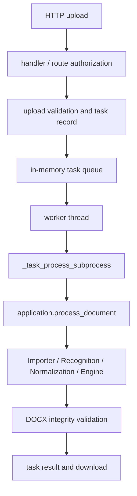
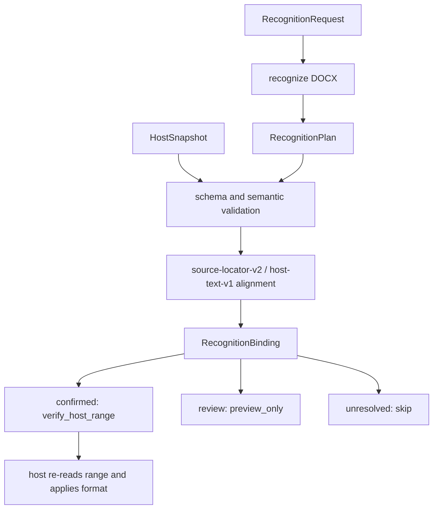

# DocxTool 当前架构

本文是项目结构、文档处理主链和运行时数据流的唯一架构说明。具体回归场景见 `DOCX_REGRESSION_CHECKLIST.md` 和 `WPS_REGRESSION_CHECKLIST.md`。

## 项目结构

```text
docxtool/
├─ src/docxtool/             Python 包、Web、SDK 与公文处理核心
├─ apps/wps/                 WPS Ribbon、TaskPane、Control 与桌面启动器
├─ apps/reader/              完全本地的 TXT Reader 业务层
├─ resources/frontend/       Web 前端与 Cloudflare Pages Worker
├─ tests/                    Python、Node 和架构回归
├─ scripts/                  构建、发布、迁移和批量验证
├─ docs/                     当前文档、设计、迁移记录和协议示例
├─ server.py                 Web 服务兼容入口
└─ pyproject.toml            包、依赖、入口和版本配置
```

逐个源码文件的职责以模块本身、测试和本架构的模块边界为准，不再维护易过期的逐文件清单。

## 文档处理主链

```text
DOCX package
  ↓
importing：读取物理块、格式、关系、图片、表格、分节和原生编号
  ↓
segmentation：建立 source locator，按可靠结构拆分逻辑段
  ↓
recognition：候选、上下文和 Beam 解码，裁决最终 type_id
  ↓
normalization：按已确认语义规范化文字、编号、日期和尾部顺序
  ↓
DocumentStructure / LayoutPolicy
  ↓
engine：按最终结构和格式配置导出完整 DOCX
```

Web、SDK 和 WPS 复用同一主链。Reader 不进入该链路。

## 文档模块职责

### Importing

`document/importing/` 只读取 DOCX 物理事实，包括 body 顺序、run 格式、表格、图片、分节、关系和 Word/WPS 原生编号定义。导入层不裁决最终段落类型，不执行文字规范化，也不调用 Engine。

### Segmentation

`document/segmentation/` 建立 raw/canonical 来源定位，处理软换行、标题正文粘连和尾部结构边界，并校验可见文字覆盖、不重叠、不过界和来源顺序。

### Recognition

`document/recognition/` 是段落语义唯一最终裁决层。候选 providers、全文 context、编号与冒号事实和 Beam decoder 共同生成最终 `type_id`、review 状态及诊断证据。旧 Legacy 实现只保留兼容输入和评分边界。

### Normalization

`document/normalization/` 只处理已经确认的结构：用户开启的文字与标点规范化、标题编号 meta、日期与附件显示、责任单位及尾部顺序。Normalization 不得重新改变最终语义类型。

### Structure、LayoutPolicy 与 Engine

`DocumentData.recognition_structure` 在规范化和一致性同步后构建。`document/analysis/layout_policy.py` 是 `NORMALIZE`、`PRESERVE_LAYOUT`、`PRESERVE_OBJECT` 的唯一推断位置。Engine 只消费最终结构、配置、物理保护事实和布局策略，不重新识别文字。

### 稳定归属

- `document/configuration/`：样式、页面和配置校验；`style_config.py` 只作兼容 facade。
- `document/diagnostics/`：项目日志与文档上下文日志。
- `document/errors.py`：共享文档异常。
- `document/importer.py`、`engine/core.py`：公开兼容入口和必要 monkeypatch 边界。

## 处理模式

| 模式 | 行为 |
| --- | --- |
| `strict` | 保留物理段落和源格式，不新增段内改写 |
| `structural` | 只拆有充分证据的结构边界，保留源文字 |
| `smart` | 对外兼容名称，统一解析为 `structural` |
| `normalize` | 在结构确认后执行用户开启的文字、标点和编号规范化 |

## Web 处理链



Web 服务使用内存任务队列、daemon worker 和 spawn 子进程。数据库记录任务状态，但不替代队列，也不在服务重启后自动重跑中断任务。

## 生产公网网关

浏览器与 WPS 的唯一公网入口为 `https://docx.toolpp.cn`。Cloudflare Pages Worker 将同源 Web、
管理后台和 `/wps-api/v1/*` allowlist 路由使用唯一的 `BACKEND_BASE_URL=https://origin.toolpp.cn`
回源；Worker 只注入 `X-Proxy-Secret` 与 `X-Docxtool-Proxy`，WPS Bearer 会话仅在 WPS
路由透传。

`origin.toolpp.cn` 的 DNS A 记录指向 `43.130.232.115`，当前不配置 AAAA。服务器由 Nginx 在
`:443` 提供 TLS，Certbot 管理 Let's Encrypt 证书，
反向代理到仅监听 `127.0.0.1:9527` 的 DocxTool。WPS 的正式 EXE 只持有一个
`public_api_base_url=https://docx.toolpp.cn`，不会了解 Origin、服务器 IP、Tunnel 或公网 `:9527`。
终端用户到 Public Gateway 可使用 IPv4 或 IPv6；Backend 生产模式下只有 `/health` 和 `/ready` 可直连
Origin 检查，所有其他 HTTP 请求必须携带 Worker 注入的 `X-Proxy-Secret`。Nginx 不复制上传业务限制，
使用 `client_max_body_size 0`，`MAX_UPLOAD_SIZE_MB` 是唯一上传大小配置。

## SDK 与宿主适配链



SDK 默认不返回正文，不调用 WPS、Office.js 或 VSTO API，也不创建真实宿主 Range。宿主必须重新读取文本并验证所有 preconditions 后才能写入。

## WPS 边界

- `apps/wps` 只负责 Ribbon、TaskPane、Host 生命周期、本地 Control、预览、事务和诊断。
- 正式排版必须调用同一 Importer、Recognition、Normalization 和 Engine。
- WPS 对象只在 Host Runtime 主线程操作；Python CommandMonitor 串行业务命令。
- 登录成功前不启动 AccountRuntime、本地服务或加载项。
- 公网授权只控制正式排版，不上传文档内容。
- Reader 只通过有界本机接口调用 `apps/reader/ReaderService`。

## 依赖不变量

1. 文档层保持 `models/analysis/text → importing/segmentation → recognition → normalization → engine` 单向依赖。
2. pipeline 和 recognition 不得反向导入 engine；engine 不得从 importer facade 获取共享模型。
3. SDK models、validation 和 manifest 保持无循环导入。
4. `web.handler` 与 `web.compatibility` 可在全新解释器独立导入。
5. 可见文字、关系、表格、图片、页眉页脚、分节和受保护对象必须完整守恒。
6. 结构排版失败必须抛出真实异常，不得降级成正文或生成假成功文件。

## 验证

```pwsh
pwsh -NoProfile -Command ".\.venv\Scripts\python.exe -m pytest tests/test_architecture_docs.py -q"
pwsh -NoProfile -Command ".\.venv\Scripts\python.exe -m ruff check src tests scripts"
pwsh -NoProfile -Command "git diff --check"
```
