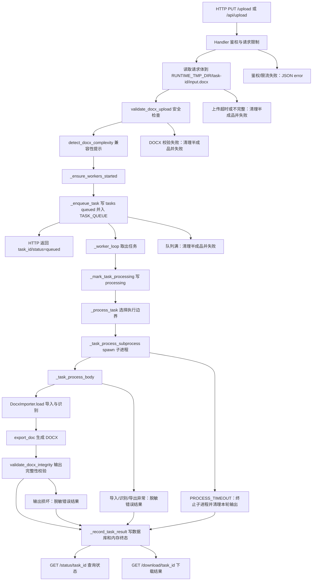
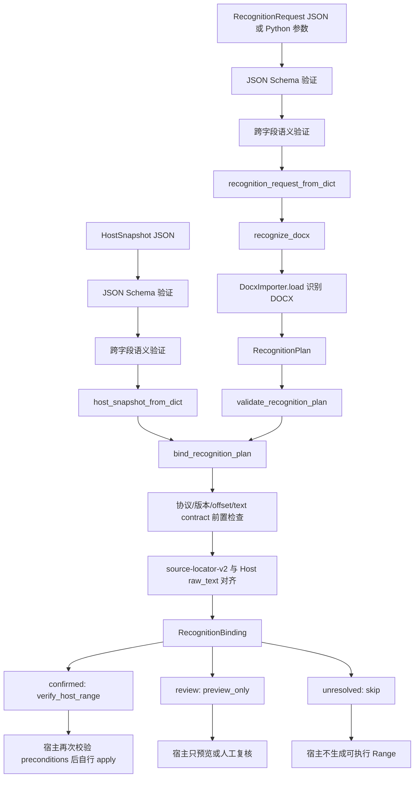

# DocxTool 架构 DAG

本文只记录现有调用链和协议边界，不引入新的运行时 DAG 调度器。当前 Web
服务仍使用内存队列、daemon worker 线程和 spawn 子进程；SDK 仍使用
`RecognitionRequest -> RecognitionPlan -> HostSnapshot -> RecognitionBinding`
的只读识别与绑定合同。

## DAG A：Web 文档处理链

### 边界说明

- Web 进程执行：HTTP 路由、鉴权、限流、上传读取、DOCX 上传安全检查、
  任务入队、状态查询和下载响应。
- worker 线程执行：从 `TASK_QUEUE` 取任务、写入 `processing`、调用
  `_process_task` 并把结果收口到 `_record_task_result`。
- 子进程执行：真实 DOCX 导入、识别、导出和输出完整性校验。子进程通过
  `multiprocessing.Queue` 返回可序列化字典，不把 traceback 或正文传给普通用户。
- 持久化边界：上传文件先落到 `RUNTIME_TMP_DIR`；入队时写 SQLite `tasks`
  queued 记录；处理完成后写 `var/outputs`、任务日志和 SQLite 终态。
- 不可交换顺序：必须先完成上传安全检查再入队；必须先写 queued 记录再通知
  worker；必须先导出并通过完整性校验再写 `done` 和下载路径。
- 可跳过或提前失败：鉴权、限流、上传读取、DOCX 校验、队列容量和子进程
  超时都会提前结束。仓库没有独立重试或取消接口；启动恢复只把
  `queued/processing` 旧记录标记为 `interrupted`，不自动重跑。

## DAG B：SDK/宿主适配链

### 协议说明

- 公共类型名称来自 `docxtool.sdk`：`RecognitionRequest`、
  `RecognitionPlan`、`HostSnapshot`、`RecognitionBinding`、
  `ValidationReport` 和 `HostSnapshotSummary`。
- Mapping 输入的顺序是 Schema 验证、语义验证、反序列化、执行。CLI 与
  Python API 共享 `validation.py`，因此错误码和 JSON path 保持一致。
- 稳定 ID 边界：`plan_id` 绑定源文件哈希、协议版本、识别引擎、包版本、
  locator 版本、宿主文本契约和请求摘要；`binding_id` 绑定 plan、snapshot、
  文档版本、目标段落、span、状态和写入前置条件。
- 隐私边界：默认 `RecognitionPlan` 不包含正文；`HostSnapshotSummary`
  是无正文摘要，只能用于诊断，不能传给 `bind_recognition_plan`。
- 宿主边界：SDK 不调用 WPS、Office.js 或 VSTO API，也不产生编辑 Range。
  `confirmed` 只表示文本快照可定位；宿主在写入前仍必须验证
  `recommended_action == "verify_host_range"` 和全部 preconditions。

## 调查结论

- I-001：没有发现仓库要求把现有队列、worker、状态机或 importer 改造成
  运行时 DAG 引擎的 ADR、测试或需求。现有测试覆盖了队列可见性、任务中断
  恢复、子进程启动和超时路径；本轮只补文档 DAG。
- I-002：`AGENTS.md` 和现有代码风格没有逐物理行注释要求。仓库已有模块
  docstring 和关键逻辑注释，本轮按高价值注释策略补充职责、边界、不变量和
  失败语义，不给显而易见的语句添加机械注释。
