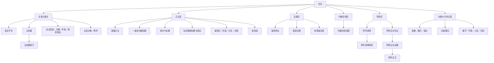

# Docxtool 公文格式与结构识别规范

> 用途：本文件用于让其他 AI、WPS 加载项或第三方程序复用 Docxtool 当前的公文识别与排版规则。
>
> 版本基线：DocxTool `5.4`。本文件描述的是本项目的默认实现和已确认的业务规则；运行时用户配置优先。不得将本文件理解为对所有机关、所有文种无条件适用的唯一国家模板。

### 依据层级

1. 上位依据为 GB/T 9704—2012《党政机关公文格式》；与其他材料冲突时以上位标准为准。
2. 广州工商学院办公室转载的[《国家机关政府部门公文格式标准（2023年新版）》](https://www.gzgs.edu.cn/yb/info/1162/2357.htm)及其 [PDF 图解](https://www.gzgs.edu.cn/__local/A/34/BB/E66E5549A459E5B967A8ED40BB5_3F185C93_169020.pdf)作为 Docxtool 本地操作和视觉验收参考，不视为 2023 年发布的新国家标准。
3. 转载材料中的个人讲解、示例文字和 Word 操作步骤不构成强制规则；页脚距离、标题行距等内部不一致参数不得覆盖本文件按上位标准确定的实现值。
4. 本项目为 WPS/Word 稳定输出确定的字号自适应、段落间距换算和 OOXML 实现属于工程规则；不得将工程扩展表述为国家标准原文。

## 1. 总体原则

1. 先识别全文结构，再决定段落格式；不能只凭某一段的字号、颜色或 Word 样式直接定型。
2. 识别和文字改写必须分开。默认使用 `structural`（结构拆分保真）模式：保留可见文字，只修复证据充分的结构边界。
3. Word 样式、字体、字号和对齐方式只能作为证据，不能单独覆盖文本、位置、上下文和同级标题关系。
4. 对总标题、一级标题、职务姓名、落款、附件等存在竞争判断时，优先使用文首位置、正文起点、前后段关系和全文同级标题族验证。
5. 不确定时保留原文字和段落顺序，输出复核项；禁止为提高“自动率”而静默改写正文。
6. 表格、图片、题注、页眉页脚、分页符和分节符均属于文档结构，不得在识别时静默丢弃。

## 2. 页面与全文默认格式

| 项目 | 默认值 |
| --- | --- |
| 纸张 | A4，宽 21.0 cm，高 29.7 cm |
| 上边距 | 3.7 cm |
| 下边距 | 3.5 cm |
| 左边距 | 2.8 cm |
| 右边距 | 2.6 cm |
| 每页行数 | 22 行 |
| 每行字符数 | 28 字符 |
| 正文行距 | 固定值 28 磅 |
| 默认段前、段后 | 0 行 |
| 文档网格 | 文字对齐字符网络 |
| 中文字体 | 按段落类型设置 |
| 拉丁字母和数字 | Times New Roman，除页码另有规定 |

横向分节不得只交换页宽和页高。应按物理页面边旋转边距：横向上=纵向左、横向下=纵向右、横向左=纵向下、横向右=纵向上；每节分别计算字符网格。

## 3. 段落类型与默认格式

本节使用中文结构名称描述用户可见的识别结果。首行缩进、文本之前缩进和文本之后缩进的单位为“字符”；段前、段后间距的单位为“行”，不是字符。除页码等页眉页脚内容外，默认使用固定 28 磅行距。中文字体按结构设置，拉丁字母和数字通常使用 Times New Roman。

### 3.1 全文结构图



结构顺序不是要求每份文档必须包含全部节点。日期、作者、职务姓名、称呼、来源说明、内嵌文档和附件均为可选结构；识别时按照实际全文证据建立节点和边界，不为补齐结构而新增文字。

### 3.2 全文结构类型对照

用户界面和审阅结果只显示“中文结构名称”。“识别结构类型”和“排版兼容类型”是开发接口中的稳定标识：识别器先输出识别结构类型，再由兼容边界转换为排版兼容类型；两者不得在用户界面中直接代替中文名称。

| 中文结构名称 | 识别结构类型 | 排版兼容类型 | 当前格式归属／处理方式 |
| --- | --- | --- | --- |
| 主标题 | `main_title` | `title` | 主标题格式 |
| 主标题续行 | `title_continuation` | `title_cont` | 主标题格式 |
| 发文字号 | `dispatch_number` | `dispatch_number` | 发文字号格式 |
| 主送对象 | `recipient` | `addressing` | 称呼格式 |
| 称呼 | `addressing` | `addressing` | 称呼格式 |
| 普通正文 | `body` | `body` | 正文格式 |
| 一级标题 | `heading1` | `heading1` | 一级标题格式 |
| 二级标题 | `heading2` | `heading2` | 二级标题格式 |
| 三级标题 | `heading3` | `heading3` | 三级标题格式 |
| 四级标题 | `heading4` | `heading4` | 四级标题格式 |
| 键值行／责任单位 | `key_value` | `responsibility_line` | 正文格式，并应用标签局部加粗和对齐规则 |
| 会议信息 | `meeting_meta` | `meeting_meta` | 当前按正文格式 |
| 会议标题元数据 | `meeting_title_meta` | `meeting_title_meta` | 作者行格式 |
| 普通日期行 | `date_line` | `date_line` | 普通日期行格式 |
| 作者行 | `author_line` | `author_line` | 作者行格式 |
| 职务姓名／署名人 | `role_name` | `role_name` | 职务姓名格式 |
| 居中小标题 | `title2` | `title2` | 居中小标题格式，不受主标题永久关闭状态影响 |
| 名词解释标题 | `glossary_title` | `glossary_title` | 名词解释标题格式 |
| 名词解释条目 | `glossary_item` | `glossary_item` | 名词解释条目格式 |
| 落款单位 | `signature_org` | `sign_org` | 落款单位格式 |
| 落款日期 | `signature_date` | `sign_date` | 落款日期格式 |
| 来源或注释 | `source_note` | `note` | 当前按正文格式 |
| 内嵌文档标题 | `embedded_document_title` | `embedded_document_title` | 主标题格式 |
| 附件说明 | `attachment_note` | `attachment_note` | 附件说明格式 |
| 附件说明续项 | `attachment_note_item` | `attachment_note_item` | 附件说明续项格式 |
| 附件正文标记 | `attachment_page_mark` | `attachment_page_mark` | 附件正文标记格式 |
| 附件正文标题 | `attachment_title` | `attachment_title` | 附件正文标题格式 |
| 附件正文 | `attachment_body` | `attachment_body` | 附件正文格式 |
| 列表 | `list` | `list` | 当前按正文格式 |
| 列表项 | `list_item` | `list_item` | 当前按正文格式 |
| 引文 | `quote` | `quote` | 当前按正文格式 |
| 注释 | `annotation` | `annotation` | 当前按正文格式 |
| 结束语 | `closing` | `closing` | 规范目标为结束语格式；当前兼容渲染器可能按正文格式兜底，需单独修复后才能保证一致 |
| 数字 | `number` | `number` | 行内数字字体规则 |
| 字母 | `letter` | `letter` | 行内拉丁字母字体规则 |
| 页码 | `page_number` | `page_number` | 页码格式 |
| 上标 | `superscript` | `superscript` | 行内上标规则 |
| 对象题注 | `caption` | `__object_caption__` | 保留原格式，仅统一题注段前段后为 0 |
| 未知格式 | `unknown` | 无 | 不建立排版映射，进入复核或按当前错误策略处理 |

以下对象属于导入、保真和导出链中的特殊结构，不是普通段落识别类型：

| 中文结构名称 | 特殊结构类型 | 处理方式 |
| --- | --- | --- |
| 表格 | `__table__` | 原样透传并迁移必要关系和样式 |
| 图片 | `__image__` | 保留对象、关系和尺寸 |
| 版头 | `__letterhead__` | 由版头专用流程处理 |
| 对象题注 | `__object_caption__` | 受保护题注，保留可见格式 |
| 原始保留内容 | `__preserved_source__` | 绕过普通段落重建，按源结构保真输出 |

兼容渲染器还保留 `attachment`、`sign_off` 等历史类型，但它们不是当前识别模型的正式全文结构输出，不应作为新增识别结果使用。

### 3.3 文首结构

| 结构 | 字体 | 字号 | 加粗 | 首行缩进（字符） | 文本之前（字符） | 文本之后（字符） | 段前（行） | 段后（行） | 行距（磅） | 对齐方式 | 备注 |
| --- | --- | --- | --- | ---: | ---: | ---: | ---: | ---: | ---: | --- | --- |
| 主标题 | 方正小标宋简体 | 二号（22 pt） | 否 | 0 | 0 | 0 | 0 | 0 | 28 | 居中 | 文首独立主标题 |
| 主标题续行 | 方正小标宋简体 | 二号（22 pt） | 否 | 0 | 0 | 0 | 0 | 0 | 28 | 居中 | 只用于连续的多行主标题 |
| 作者行 | 楷体_GB2312 | 三号（16 pt） | 是 | 0 | 0 | 0 | 0 | 0 | 28 | 居中 | 作者、署名行 |
| 会议标题元数据 | 楷体_GB2312 | 三号（16 pt） | 是 | 0 | 0 | 0 | 0 | 0 | 28 | 居中 | 仅用于完整的“标题＋括号日期＋会议说明”结构 |
| 普通日期行 | 楷体_GB2312 | 三号（16 pt） | 是 | 0 | 0 | 0 | 0 | 0 | 28 | 居中 | 不参与标题区留白 |
| 职务姓名／署名人 | 楷体_GB2312 | 三号（16 pt） | 是 | 0 | 0 | 0 | 条件值 | 条件值 | 28 | 居中 | 标题后段前 1 行；后接正文、称呼或标题时段后 1 行；后接日期时段后 0 |
| 发文字号 | 仿宋_GB2312 | 三号（16 pt） | 否 | 0 | 0 | 0 | 0 | 0 | 28 | 居中 | 版头中的专用间距见第 6 节 |
| 首次称呼／主送语 | 仿宋_GB2312 | 三号（16 pt） | 否 | 0 | 0 | 0 | 1 | 0 | 28 | 左对齐 | 例如“各位委员、同志们：” |
| 正文中的重复称呼 | 仿宋_GB2312 | 三号（16 pt） | 否 | 0 | 0 | 0 | 0 | 0 | 28 | 左对齐 | 不重复增加段前留白 |

主标题、主标题续行、作者行或会议标题元数据直接进入正文或一级标题时，可以通过一个真实空段形成一行留白；该空段不是前一段的段后值。普通日期行不参与这项标题区留白。

### 3.4 正文结构

| 结构 | 字体 | 字号 | 加粗 | 首行缩进（字符） | 文本之前（字符） | 文本之后（字符） | 段前（行） | 段后（行） | 行距（磅） | 对齐方式 | 备注 |
| --- | --- | --- | --- | ---: | ---: | ---: | ---: | ---: | ---: | --- | --- |
| 一级标题 | 黑体 | 三号（16 pt） | 否 | 2 | 0 | 0 | 0 | 0 | 28 | 左对齐 | `一、标题`；独立标题末尾不保留 `。` |
| 二级标题 | 楷体_GB2312 | 三号（16 pt） | 是 | 2 | 0 | 0 | 0 | 0 | 28 | 左对齐 | `（一）标题` |
| 三级标题 | 仿宋_GB2312 | 三号（16 pt） | 是 | 2 | 0 | 0 | 0 | 0 | 28 | 左对齐 | `1.标题`；使用半角句点 `.` |
| 四级标题 | 仿宋_GB2312 | 三号（16 pt） | 否 | 2 | 0 | 0 | 0 | 0 | 28 | 左对齐 | `（1）标题` |
| 普通正文 | 仿宋_GB2312 | 三号（16 pt） | 否 | 2 | 0 | 0 | 0 | 0 | 28 | 两端对齐 | 标签等局部内容可以加粗，不代表整段加粗 |
| 居中小标题 | 黑体 | 三号（16 pt） | 否 | 0 | 0 | 0 | 1 | 1 | 28 | 居中 | 非主标题的正文小标题 |
| 名词解释标题 | 方正小标宋简体 | 二号（22 pt） | 否 | 0 | 0 | 0 | 1 | 1 | 28 | 居中 | 段前分页 |
| 名词解释条目 | 仿宋_GB2312 | 三号（16 pt） | 局部加粗 | 2 | 0 | 0 | 0 | 0 | 28 | 两端对齐 | 只允许术语标签等局部内容加粗，不因历史加粗拆段 |
| 责任单位／键值行（单行） | 仿宋_GB2312 | 三号（16 pt） | 局部加粗 | 2 | 0 | 0 | 0 | 0 | 28 | 左对齐 | 标签加粗，值不加粗 |
| 责任单位／键值行（多行） | 仿宋_GB2312 | 三号（16 pt） | 局部加粗 | 0 | 2 | 0 | 0 | 0 | 28 | 左对齐 | 手动换行后的可见行保持对齐 |
| 结束语 | 黑体 | 三号（16 pt） | 否 | 0 | 0 | 0 | 0 | 0 | 28 | 居中 | 文末独立结束语 |

标题与正文处于同一物理段落时，标题部分和正文部分可以分别应用字体与字重。普通正文中的软换行不得一律拆段，只有具备明确结构证据时才建立新的逻辑段落。

### 3.5 文尾结构

| 结构 | 字体 | 字号 | 加粗 | 首行缩进（字符） | 文本之前（字符） | 文本之后（字符） | 段前（行） | 段后（行） | 行距（磅） | 对齐方式 | 备注 |
| --- | --- | --- | --- | ---: | ---: | ---: | ---: | ---: | ---: | --- | --- |
| 落款单位 | 仿宋_GB2312 | 三号（16 pt） | 否 | 0 | 0 | 2 | 1 | 0 | 28 | 右对齐 | 紧接附件说明时，段前调整为 3 行 |
| 落款日期 | 仿宋_GB2312 | 三号（16 pt） | 否 | 0 | 0 | 4 | 0 | 0 | 28 | 右对齐 | 使用阿拉伯数字中文日期 |

### 3.6 附件结构

| 结构 | 字体 | 字号 | 加粗 | 首行缩进（字符） | 文本之前（字符） | 文本之后（字符） | 段前（行） | 段后（行） | 行距（磅） | 对齐方式 | 备注 |
| --- | --- | --- | --- | ---: | ---: | ---: | ---: | ---: | ---: | --- | --- |
| 附件说明 | 仿宋_GB2312 | 三号（16 pt） | 否 | 0 | 2 | 0 | 1 | 0 | 28 | 左对齐 | 附件说明首项 |
| 附件说明续项 | 仿宋_GB2312 | 三号（16 pt） | 否 | 0 | 5 | 0 | 0 | 0 | 28 | 左对齐 | 多项附件的后续条目 |
| 附件正文标记 | 黑体 | 三号（16 pt） | 否 | 0 | 0 | 0 | 0 | 1 | 28 | 左对齐 | 段前分页 |
| 附件正文标题 | 方正小标宋简体 | 二号（22 pt） | 否 | 0 | 0 | 0 | 1 | 1 | 28 | 居中 | 不再叠加通用标题留白 |
| 附件正文 | 仿宋_GB2312 | 三号（16 pt） | 否 | 2 | 0 | 0 | 0 | 0 | 28 | 两端对齐 | 正文默认格式 |

### 3.7 页码

| 结构 | 字体 | 字号 | 加粗 | 首行缩进（字符） | 文本之前（字符） | 文本之后（字符） | 段前 | 段后 | 行距 | 对齐方式 | 备注 |
| --- | --- | --- | --- | ---: | ---: | ---: | --- | --- | --- | --- | --- |
| 页码 | 宋体 | 四号（14 pt） | 否 | 0 | 外侧 1 | 外侧 1 | 不适用 | 不适用 | 页脚控制 | 奇数页靠右、偶数页靠左 | 格式为 `— 1 —`，首页正常编号 |

## 4. 标题层级与编号

### 4.1 标准编号

```text
一、一级标题
（一）二级标题
1.三级标题
（1）四级标题
```

规则：

1. 一级标题使用中文数字加顿号 `、`。
2. 二级标题使用全角中文括号和中文数字：`（一）`。
3. 三级标题使用阿拉伯数字和半角点：`1.`，不得转换为 `1。`。
4. 四级标题使用全角括号和阿拉伯数字：`（1）`。
5. 用户开启“序号规范”时，最终识别完成后重建一至四级编号；先清除源前缀和错误前缀，避免形成 `3..标题`、`（1）（1）标题` 等重复编号。
6. 用户关闭“序号规范”时，保留原始编号，不得擅自重排。
7. 独立一级标题末尾的句号应删除；正文中的句号、三级标题编号中的半角点、时间 `11:00`、网址和小数不得机械转换。

### 4.2 标题与正文粘连

当同一物理段落满足“编号标题 + 第一个中文句号后至少 5 个可见正文字符”时，应拆分：

```text
输入：一、一级标题。这里是正文说明。
输出：一、一级标题
      这里是正文说明。
```

即使段内混有软换行、制表符或手动分页符，只要标题与正文边界可靠，也应优先拆分；正文不得继承标题字体或加粗。该规则仅适用于证据充分的结构边界，不适用于普通正文中的任意句号。

## 5. 文首结构识别

文首按以下状态理解：

```text
版头信息区 → 主标题/副标题区 → 职务姓名或日期区（可选）
→ 称呼区（可选）→ 正文区 → 结尾区 → 附件区
```

### 5.1 主标题判断

主标题不依赖具体标题关键词，综合判断：

- 位于文档前部，之前不存在正文；
- 独立成段、居中、相对正文较大字号或较高加粗比例；
- 后接副标题、职务姓名、日期、称呼或正文；
- 全文不存在与其并列的同级结构标题；
- Word 的 `Heading 1`、`标题 1` 仅是弱证据。

“在……上的讲话”这类文首讲话标题，即使误用了一级标题样式，也优先参与主标题竞争；不得仅因样式生成“一、”。

### 5.2 一级至四级标题判断

标题必须结合：

- 是否已进入正文区；
- 编号形态与层级；
- 后方是否存在正文、下级标题或同级标题；
- 全文是否有 `一、二、三、`、`（一）（二）` 等同级标题族；
- 相邻段落的格式和结构状态。

单独出现的编号标题可被识别，但证据不足时应标记复核，不能只凭 Word 样式获得高确定性。

## 6. 版头

### 6.1 开关语义

1. **开启版头**：移除已识别的正文流版头，并按当前填写的机关、文号、签发人和版式重新生成版头。
2. **关闭版头**：不新增、不替换已有版头；仅在文首存在“结构化发文字号 + 可选签发人、且缺少红线”的明确不完善版头时，在末行签发人后补分隔线。
3. 正文引用的文件编号、普通红字、图片、孤立红色边框和“关于……文件”标题均不得误判为版头。
4. 版头仅作用于首页首个标题之前的正文流，不新增分节、不重设全篇页面边距或网格。

### 6.2 生成格式

| 项目 | 规则 |
| --- | --- |
| 发文机关标志 | 方正小标宋简体，32 pt，红色、居中；过长时仅在 55%～100% 范围内横向压缩，不自动放大字号，无法单行排入版心时明确失败 |
| 标志上方 | 3 个固定 28 pt 空行；每个空行段前、段后、文本之前、文本之后和首行缩进均为 0 |
| 标志段落 | 固定行距等于实际标志字号，默认 32 pt 字号对应 32 pt 固定行距，不使用 28 pt 正文行距；段前、段后、文本之前、文本之后和首行缩进均为 0 |
| 标志下方 | 2 个当前正文行距空行，随后紧接发文字号；空行其余段落参数均为 0 |
| 发文字号 | 居中；中文按中文字体，拉丁字母和数字用 Times New Roman；首行缩进 0 |
| 签发人 | 与发文字号同区，段前段后 0；多行换行后与上一行第一名对齐 |
| 分隔线 | 可选红色直线或中央五角星＋左右红线；红线前保留 4 mm 物理距离，红线至标题为当前正文行距 × 2 |
| 发文字号、签发人 | 段前、段后均为 0 行；下行文发文字号文本之前、文本之后和首行缩进均为 0 |

当前产品界面只启用单机关发文；Core 仅为历史配置保留联合发文能力，自动识别到联合源版头时不自动替换。

### 6.3 下行文首页视觉验收

“正式公文（下行文）首页版式”图仅用于核对版面关系，不复制图中的机关名称、年份、文号或示例正文。验收时应同时满足：

- 使用 A4 页面，上、下、左、右边距分别为 37 mm、35 mm、28 mm、26 mm，版心为 156 mm × 225 mm；
- 发文机关标志上方为 3 个固定 28 pt 空行；标志在版心内单行居中，文字完整，不得因固定使用过大字号把末字挤到下一行；标志段固定行距等于最终实际标志字号，不按 28 pt 正文行距计算；
- 标志下方为 2 个当前正文行距空行，随后直接编排发文字号；这些空行、标志和下行文发文字号除明确行距外，段前、段后、文本之前、文本之后和首行缩进均为 0；
- 下行文发文字号居中，首行缩进为 0；年份使用全称并置于六角括号中，顺序号不加“第”字、不编虚位；
- 严格国标样式在发文字号下 4 mm 设置与版心等宽的红色直线；中央五角星加左右红线仅作为用户显式选择的项目扩展样式；
- 标题位于红线下空二行位置，多行标题保持词意完整，并按梯形或菱形居中排列；标题下空一行编排主送机关；
- 首页必须显示正文；主送机关过多导致首页无法显示正文时，应将主送机关移至版记；
- 视觉验收应核对三个顶部空行、两个标志下方空行、机关标志单行完整、文号至红线、红线宽度和红线至标题间距，不能仅凭截图观感判断合格。

## 7. 落款、日期与键值行

### 7.1 落款顺序

可靠边界下，最终顺序固定为：

```text
正文
附件说明
附件说明续项
落款单位
成文日期
附件正文页（如有）
```

落款单位使用仿宋_GB2312、三号、右对齐，右侧空 2 字；段前 1 行、段后 0。成文日期使用仿宋_GB2312、三号、右对齐，右侧空 4 字，段前段后 0。

成文日期统一为阿拉伯数字中文日期，例如：

```text
2025年10月15日
```

不得在没有可靠全文来源时，擅自把机关简称扩写为全称。

### 7.2 键值/责任单位行

适用于 `责任单位：区政府`、`联系人：张三`、`联系电话：12345678` 等独立行：

- 全行三号、固定 28 磅、段前段后 0；
- `A：` 加粗，`B` 不加粗；
- 单行首行缩进 2 字符；
- 多条键值通过手动换行位于同一段时，使用等效 2 字符左缩进，保证每个可见行对齐；
- 重复粘连的 `责任单位：` 应按多行责任单位结构拆分。

## 8. 附件

### 8.1 附件说明

```text
附件：1. 基本情况
      2. 具体情况
```

- 首项使用“附件说明”样式：仿宋_GB2312、三号、左对齐、段前 1 行、段后 0、左缩进 2 字符；
- 续项使用“附件说明续项”样式：段前 0、段后 0、左缩进 5 字符；
- 不插入真实空段模拟间距；
- 不得把结构编号 `附件：2.材料` 中的半角点误转为句号。

### 8.2 附件正文页

- 附件页标记使用黑体三号，段前 0、段后 1 行，并在其前分页；
- 附件正文标题使用方正小标宋简体二号、居中、段前段后各 1 行；
- 附件正文使用仿宋_GB2312三号、两端对齐、首行缩进 2 字符；
- 附件标题后不得再通过通用“标题后留白”叠加空行。

## 9. 页码、表格、图片与题注

### 9.1 页码

- 默认启用，宋体四号（14 pt），格式 `— 1 —`；
- 使用外侧位置：奇数页居右、偶数页居左；首页正常编号；
- 不得因奇偶页页脚创建额外空段，避免偶数页正文少排一行；
- 页码、页眉页脚属于分节属性，应保留并按分节正确续编或重编。

### 9.2 表格、图片和题注

1. 表格默认原样透传，不自动修改字体、列宽、边框、行高和对齐。
2. 复制表格必须同时迁移其引用的关系部件、样式及继承链；关系无法完整迁移时应中止导出，不能生成缺数据文档。
3. 表格或纯图片下紧邻的一行 `表一`、`表1`、`图一`、`图2` 等题注受保护：保留文字、对象尺寸、字体、字号、对齐和关系资源，仅统一题注段前段后为 0。
4. 含正文文字和行内图片的混合段不是纯图片段，下一段不应自动受题注保护。

## 10. 标点与文字规范化

1. 中文语境中的逗号、句号、冒号、分号、问号、叹号、括号和引号应优先使用中文全角形式。
2. 不得机械转换下列内容：三级标题 `1.`、时间 `11:00`、小数、英文、网址、页码和其他明确的拉丁/数字格式。
3. 安全标点修复是独立开关。关闭时不得转换普通正文标点；开启时仅处理安全范围。
4. `strict` 和 `structural` 模式默认不执行普通文字标点转换；`normalize` 模式或用户显式开启标点修复时才执行。

## 11. 识别与处理模式

| 模式 | 目标 | 允许的处理 | 禁止的处理 |
| --- | --- | --- | --- |
| `strict` | 完全保留物理结构 | 样式应用、明确配置的页面参数 | 拆段、重排、普通文字改写、自动编号 |
| `structural` / `smart` | 默认模式，结构拆分保真 | 可靠软换行拆分、标题正文拆分、可靠尾部排序、明确日期/标题规则、用户显式开关 | 无依据的正文改写、普通段落合并、关闭开关后的标点/编号修复 |
| `normalize` | 主动规范化 | `structural` 的能力，加编号、标点和旧兼容规范化 | 不得损坏表格、图片、题注或无关正文 |

识别执行模式：

- `legacy`：仅使用旧识别逻辑；
- `shadow`：新识别器只评估，不接管最终类型；
- `authoritative`：默认生产模式，新识别器通过统一映射写入最终类型，渲染器按该结果排版。

## 12. 给其他 AI 或 WPS 适配器的执行要求

1. 读取当前文档时必须保留段落顺序、段落样式、运行级字体、手动换行、分页符、分节、表格、图片、页眉页脚和页码信息。
2. 先扫描全文并建立文首、正文、结尾、附件和标题族，再分类单段。
3. 对当前打开的 WPS 文档，应先取得 DOCX 快照并调用识别 SDK；SDK 返回段落锚点、类型和格式角色后，再由 WPS API 原位修改当前文档。
4. 应在写回前验证段落序号、原文短哈希及相邻锚点，文档已被用户修改时不得套用过期识别结果。
5. 表格、图片和题注默认保护；不因排版方便而删除、替换或缩放对象。
6. 发现 `review` 或 `critical_review` 时，应提示用户复核，不能伪装成高确定性自动结果。
7. 不记录或上传用户正文、密钥、Cookie、会话标识、数据库文件或原始日志。

## 13. 最小验收清单

- 主标题、职务姓名、日期、称呼和正文边界正确；
- 一至四级标题序号正确，标题与正文不粘连；
- 版头仅影响首页，开启/关闭语义正确；
- 落款、日期、附件说明和附件正文顺序正确；
- 页码为奇右偶左，首页正常编号；
- 表格、图片、题注和横向分节未被破坏；
- 正文保持 28 字符、22 行、固定 28 磅的默认布局目标；
- 低确定性识别项可见、可复核，且没有无依据的文字改写。
